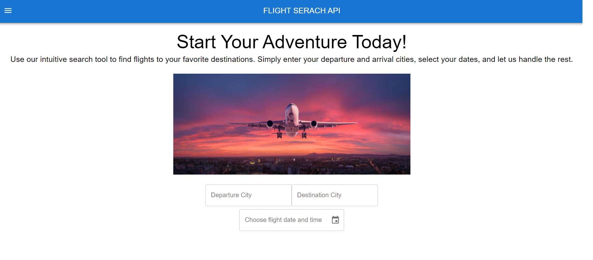
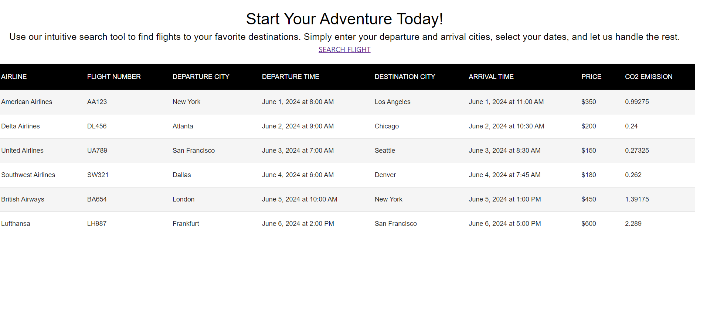

# React Flights Search API

 React application for the simple search form and results. This project was bootstrapped with [Create React App](https://github.com/facebook/create-react-app).

## Table of Contents

- [Installation](#installation)
- [Running the Application](#running-the-application)
- [System Design Document](#system-design-document)
- [Further Considerations](#further-considerations)
- [Learn More](#learn-more)


## Installation

1. Clone the repository:

   ```bash
   git clone https://github.com/bsarna89/Flight-Search-API.git
   cd react-search-ui
   ```

2. Go to /react-search-ui directory and install dependencies

   ```bash
   npm install
   ```

## Running the Application

### Start the application:

```bash
npm start
```
Runs the app in the development mode.\
Open [http://localhost:3000](http://localhost:3000) to view it in your browser.

```bash
npm test
```
Launches the test runner in the interactive watch mode.\
See the section about [running tests](https://facebook.github.io/create-react-app/docs/running-tests) for more information.


```bash
npm run build
```

Builds the app for production to the `build` folder.\
It correctly bundles React in production mode and optimizes the build for the best performance.

The build is minified and the filenames include the hashes.\
Your app is ready to be deployed!

See the section about [deployment](https://facebook.github.io/create-react-app/docs/deployment) for more information.


## System Design Document
### Purpose
The purpose of this document is to outline the design of a flight search application. This document will detail the system architecture, components, database schema, and GraphQL APIs to be used in the development of the application.

### Scope
This document covers the design of the flight search application, which includes:

- A main page for searching flights.
- A functionality to find the first available flight when a searched flight is missed.
- A separate page displaying a table of all available flights.


### System Overview
The flight search application is a web-based system that allows users to search for flights based on departure location, destination, and departure time. If the searched flight is missed, the system will provide the first available flight with the same destination and departure. The application also includes a page displaying a table of all available flights.

### Main Page


### Flight Display


### Flights Table Page



## Further Considerations

### Error Handling and Validation
- Form Validation: Ensure that user inputs are validated before submission. For example, ensure that the departure and destination are not the same, and that the departure time is in the future.
- Error Messages: Provide user-friendly error messages for common issues such as invalid input or network errors.

### Responsiveness
- Ensure that the application is responsive and works well on different screen sizes and devices, including desktops, tablets, and smartphones.

### Accessibility
- WCAG Compliance: Ensure that the application is accessible to users with disabilities by following WCAG (Web Content Accessibility Guidelines).
- Keyboard Navigation: Provide keyboard navigation support for all interactive elements.

### Continuous Integration/Continuous Deployment (CI/CD)
- Automated Testing: Implement automated testing (unit, integration, and end-to-end tests) to ensure code quality and reliability.
- Automated Deployment: Set up automated deployment pipelines to streamline the deployment process and reduce manual errors.

### Monitoring and Analytics
- Application Monitoring: Use monitoring tools such as New Relic, Datadog, or Prometheus to track application performance and identify issues in real-time.
- Analytics: Implement analytics tools to track user behavior and gather insights into how the application is used, helping to inform future improvements.

## Future Scalability

### Microservices Architecture
- Consider evolving the backend into a microservices architecture as the application grows, allowing different parts of the system to scale independently.

### Cloud-Native Services
- Leverage cloud-native services and serverless architectures to handle varying loads and reduce infrastructure management overhead.


## Learn More

You can learn more in the [Create React App documentation](https://facebook.github.io/create-react-app/docs/getting-started).

To learn React, check out the [React documentation](https://reactjs.org/).


